# Unity Space Sharing Sample
This Unity sample demonstrates the concept of Space Sharing, a feature provided in
[Meta's Mixed Reality Utility Kit (MRUK)](https://developers.meta.com/horizon/documentation/unity/unity-mr-utility-kit-overview/).

Space Sharing APIs allow **Colocated Multiplayer apps** to quickly and easily synchronize
[real-world Scene entities and geometry](https://developers.meta.com/horizon/documentation/unity/unity-scene-overview/)
among clients.

## Before You Begin
Install [Unity Hub](https://unity.com/download).

This project was developed with
**[Unity 2022.3.15f1](unityhub://2022.3.15f1)**,
which is MRUK's minimum-supported engine version at the time of publishing.
- It is recommended to **use this version** when exploring this sample.

Your Unity Editor installation MUST include the modules:
- Android Build Support
- OpenJDK
- Android SDK & NDK Tools

It is RECOMMENDED to also include the Visual Studio install option if you don't already have it or any other C# IDE installed.

**Clone this project** somewhere to your disk with:
```bash
git clone git@github.com:oculus-samples/Unity-SpaceSharing.git
```
or if you prefer, clone by pasting the repo URL into the Git GUI of your choice.

## Loading the Unity Project
1. Open Unity Hub.

2. Do once: In the Project window, use the "Add ▼" dropdown > "Add project from disk" and locate your clone of this sample.

3. If this is your first time loading the project, make sure to open the "Editor Version" options for it and change the platform from "Current Platform" to "Android". Click "Open with 2022.3.15f1"; this first import will take a few minutes.
   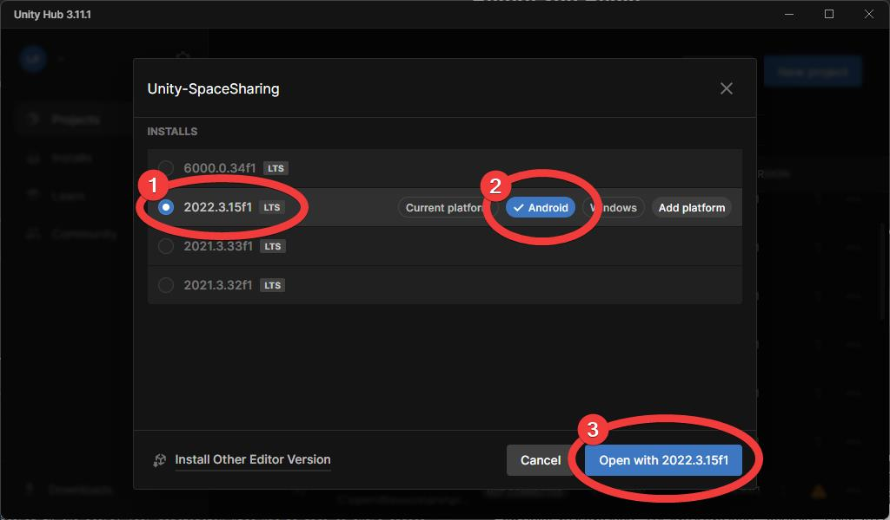

4. Once the project is open, you will find the sample's relevant scenes under
   [Scenes/](./Assets/Scenes),
   scripts in
   [Scripts/](./Assets/Scripts),
   and so on.
   You will find all key Space Sharing API calls within
   **[Scripts/MRSceneManager.cs](./Assets/Scripts/MRSceneManager.cs)**.

## Horizon Store App Configuration Part 1
Meta verifies the identity of the application requesting access to persisted Spatial Anchors and Space Sharing.
Because this verification uses information registered in the Store, your application will not be able to share spaces until you register your app with the [Meta Horizon Developer Dashboard](https://developers.meta.com/horizon/manage).

1. Sign in to your developer organization's dashboard.

2. Click **"Create a new app"**.

2. In the dialog, give your test app a descriptive **App Name** (this will only be its name in the dashboard), select **"Meta Horizon Store"** for the Platform, and check **"Assign to Test Store"** before clicking "Create".
   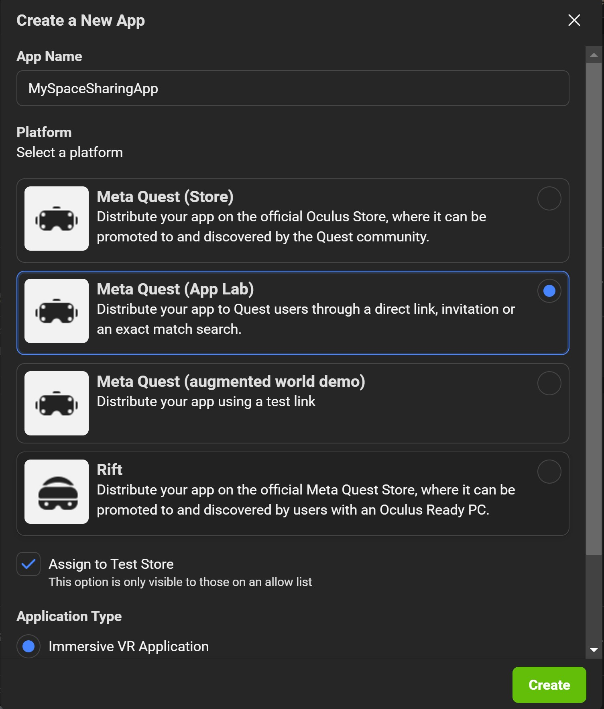

3. In your new app's dashboard, navigate via the left panel to "Requirements" > "Data Use Checkup" (**DUC**).
   Once there, **request access to _"User ID"_ and _"User Profile"_**.
   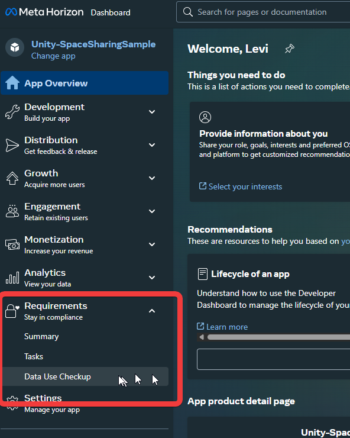

4. Next, navigate to "Development" > "API" using the left panel, then locate and **copy your _App ID_**.
   

5. Return to Unity.

6. Navigate to Meta > Platform > Edit Settings.
   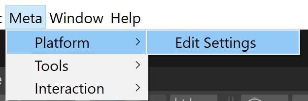

7. **Paste your _App ID_** into the "Meta Quest/2/Pro" Application ID field.
   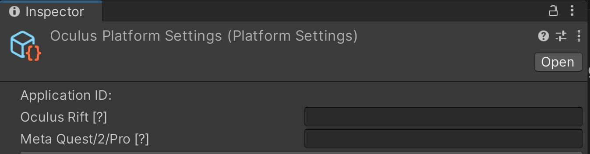

8. Under the "Build Settings" foldout, change the "Bundle Identifier" to something unique to you.
   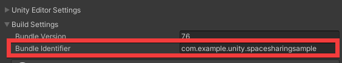

Repeat these steps and create a Rift app if you will use Meta Quest Link to run the app from your PC.

We will be returning to this dashboard [after we have a built APK to upload](#horizon-store-app-configuration-part-2).

## Photon Networking Configuration

The main portion of this sample also makes use of Photon Networking, so you will need a free Photon account and a Photon Realtime application set up in their dashboard.

1. Go to
   [Photon's developer dashboard](https://dashboard.photonengine.com/).
2. Sign in or create an account.
3. Dashboard: Click "CREATE A NEW APP +".
4. For "Photon SDK", select "Realtime".
   **Do not select "Pun"!**
   
5. Enter anything good for "Application Name".
   (The bundle identifier you created at the end of
   ["Horizon Store App Configuration Part 1"](#horizon-store-app-configuration-part-1)
   is good.)
6. "Description" and "Url" are not required.
7. Click "CREATE".
8. **Copy** the new app's Photon App ID.
   
9. Return to Unity.
10. Open the PhotonServerSettings.
    Menu Bar > "Window" > "Photon Unity Networking" > "Highlight Server Settings".
    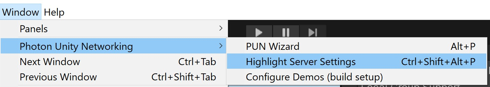
11. **Paste** the Photon App ID in the "App Id PUN" field.
    


## Core SDK Configuration

Beyond the app identities configured above, most required settings in this sample should come pre-applied.

Nevertheless, here we highlight these required settings so that you can be sure your own apps and explorations will continue to work properly.

The following settings can be found primarily by inspecting
[Oculus/OculusProjectConfig.asset](./Assets/Oculus/OculusProjectConfig.asset),
however these same settings can also be modified by inspecting any `OVRCameraRig` component found in Scenes or Prefabs.

> **NOTE:** After changing any of these settings and **before you build**, you should run Menu Bar > "Meta" > "Tools" > "Update AndroidManifest.xml".

#### General | Features
- "Anchor And Space Sharing Support" = **Required**
- "Scene Support" = **Required**
- "Passthrough Support" = **Required**

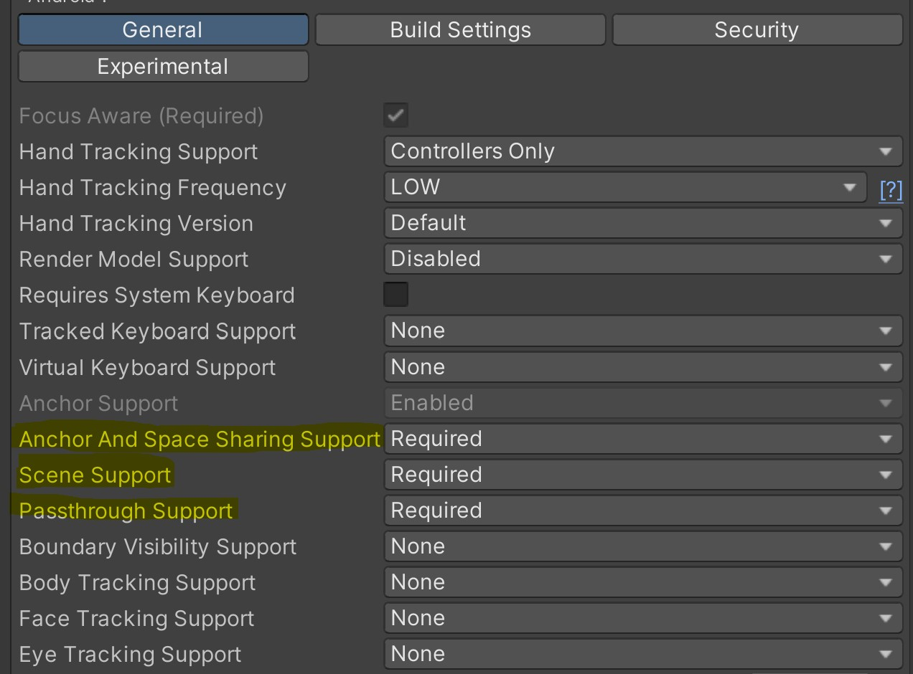

#### Permission Requests On Startup
- [x] Scene

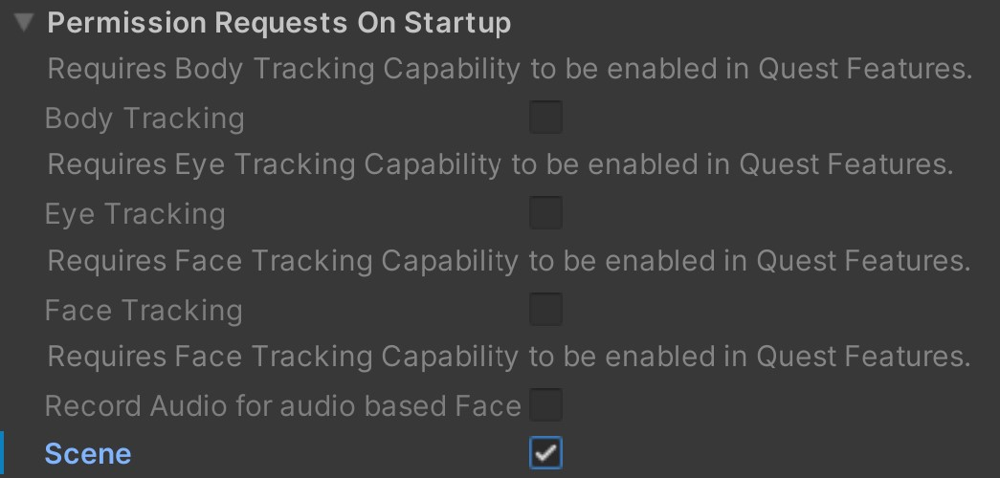

---
## Building the Space Sharing Sample

> REMINDER: If anything in **OculusProjectConfig.asset** hsa changed, you should run Menu Bar > "Meta" > "Tools" > "Update AndroidManifest.xml" before building.

You can build the Space Sharing Sample as you would any Quest/Android app.
- [Refer here for more detailed Quest-specific instructions](https://developers.meta.com/horizon/documentation/unity/unity-build).

In order to later [upload an initial verification build](#upload-a-build), you will need to sign the build with a **non-debug keystore**.
- For instructions on how to set up a non-debug keystore in Unity, [refer here](https://docs.unity3d.com/Manual/android-keystore-create.html).
- You only need to use a non-debug keystore for builds that will be uploaded to the Store; otherwise, debug keystores suffice.

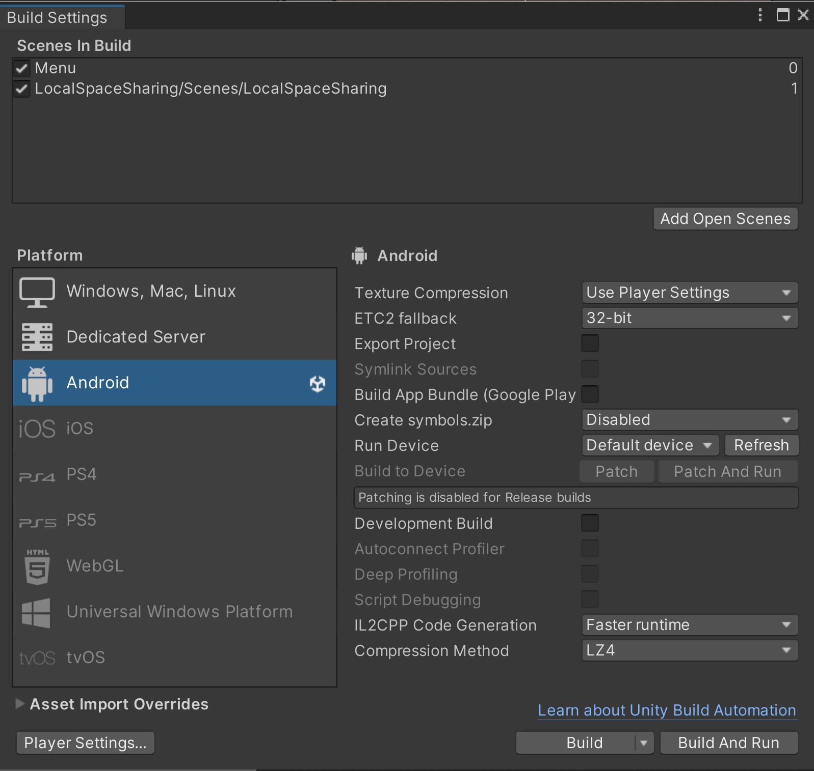

> NOTE: We recommend enabling "Development Build".
> Doing so enables a lot more debug information which may be helpful, plus it allows you to define a "Dev Region" in the PhotonServerSettings asset, which you may also find useful.

## Horizon Store App Configuration Part 2
### Adding Users

In order to obtain entitlements for the user accounts used during development (including test users), you should add them to one of the **Release Channels** associated with your app.
- [Horizon docs on Release Channels and their users](https://developers.meta.com/horizon/resources/publish-release-channels-add-users/)

Release Channels are found in the Distribution section of the app configuration.
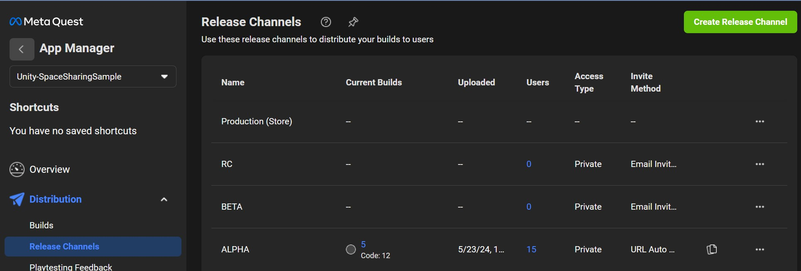

Click on the blue number in the "Users" column to view the allowed users for a channel.

From that view, you can click **"Email Invite Users"** and enter the email(s) associated with the Meta/Quest user account(s):

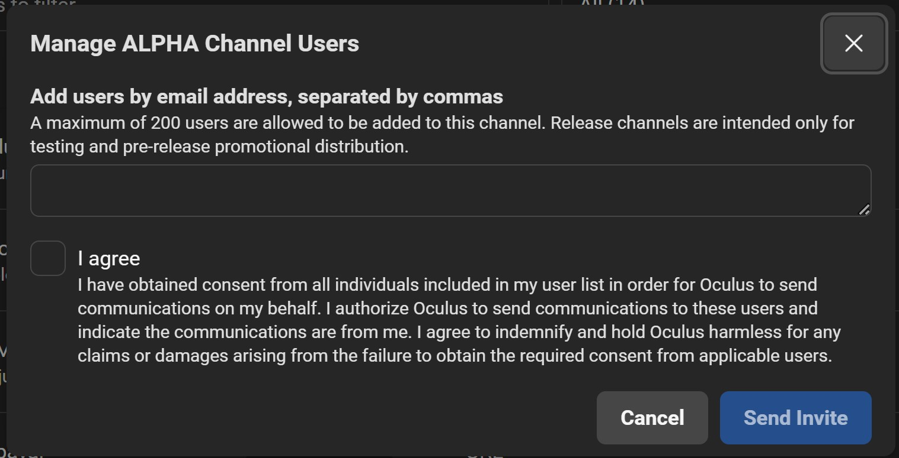

> Note: This list accepts both real users and test users, and they do not need to be part of your developer org.

### Adding Test Users
Test Users are a convenient way to test multi-player experiences.
Check out the developer site for more information on
[creating and using test users](https://developers.meta.com/horizon/resources/test-users/).

### Upload a Build
Finally, you should use
[Meta Quest Developer Hub (MQDH)](https://developers.meta.com/horizon/documentation/unity/ts-mqdh/)
to upload an APK for your test app to the same release channel you added your development users to.
Make certain that the APK is built using the App ID that matches the one [printed in the dashboard](#horizon-store-app-configuration-part-1).
This ensures that the build is associated with the correct Store app, and that the runtime entitlement checks can succeed.
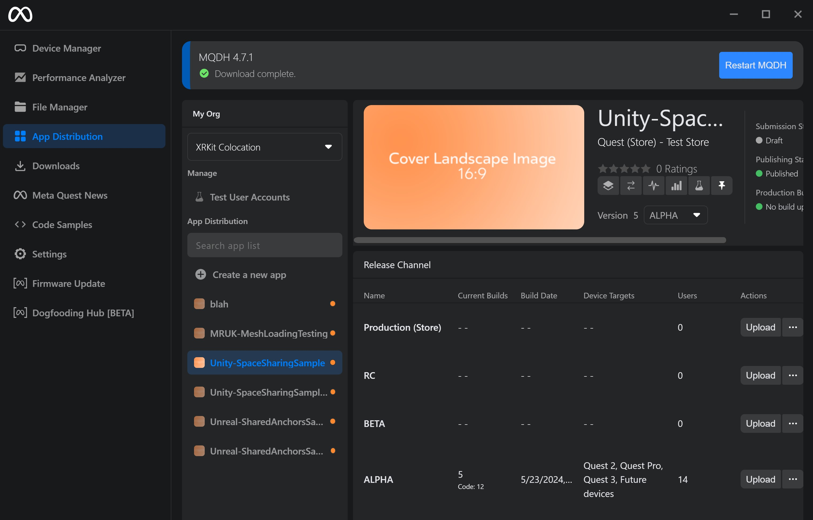

##### Keystore Reminders:
- Any APK uploaded to your Store dashboard _must_ have been signed with a non-debug keystore.
- For the scope of these samples, you only need to upload _one_ APK, and that's to validate your project and associate your build's bundle ID with your Store app.
- If, however, you need to upload more builds, **all uploaded APKs must be signed with the same keystore as the first**.
- [Unity's documentation on keystores](https://docs.unity3d.com/Manual/android-keystore.html)

---
# Running the Space Sharing Sample
## Installing to a device
You can use [MQDH](https://developers.meta.com/horizon/documentation/unity/ts-mqdh/) to drag-and-drop install APKs onto an attached Quest device.
Using the kebab menu next to each installed app, you can also launch these apps from MQDH (which comes in handy if you can't find them in your App Library after installing).

The above is alternatively feasible using plain `adb`, which we recommend if you're more comfortable with a terminal.
To install an APK "SpaceSharing.apk":
```bash
adb install -r ~/Builds/SpaceSharing.apk
```

and to launch (pre-Unity 6000):
```bash
bundleId="the.bundle.id.you.made.earlier"
adb shell am start -n "$bundleId/com.unity3d.player.UnityPlayerActivity"
```

to launch in Unity 6000 or later (if the entry point is unchanged in Player Settings):
```bash
adb shell am start -n "$bundleId/com.unity3d.player.UnityPlayerGameActivity"
```

## Main Menu
The button "MRUK Space Sharing w/ Photon (PUN)" launches [Scenes/LocalSpaceSharing.unity](./Assets/Scenes/LocalSpaceSharing.unity).

### Scene 1 - "MRUK Space Sharing" Sample Flow
1. The left-hand UI panel contains all your controls and indicators.
    - When the scene first starts, the lobby buttons will be disabled until Photon connects to your region's master server.

2. The Host user creates a Photon room by selecting **"Create New Room"**.

3. Guest users can select **"Find Room"** to find the Host's session and then join it.

4. When the Host selects **"Load or Scan Space"** they will load scene data for their current surroundings that were previously captured via [Space Setup](https://www.meta.com/help/quest/articles/getting-started/getting-started-with-quest-3/suggested-boundary-assisted-space-setup/).
    - If the scene data for the current physical room is not already captured, then the sample is configured to automatically launch Space Setup.
    - This automatic request is controlled by the boolean `requestSceneCaptureIfNoDataFound` parameter passed to `MRUK.Instance.LoadSceneFromDevice()`.
    - See also: [MRSceneManager > LoadOrScanLocalSceneImpl()](./Assets/Scripts/MRSceneManager.cs)

5. After the Host has loaded scene data they can click **"Share This Space"** to share the scene with the Photon room and all its Guests (including late joiners, until Host leaves).
    - This invokes Meta’s anchor _sharing_ backend (via MRUK) to share the root room anchor to an arbitrary "Group UUID", which is subsequently published to the Photon room so everyone can refer to it for loading.

6. If nothing loads automatically, users can try clicking **"Load Shared Spaces"** to (re)load the room’s total shared data.
    - This (and the automatic variants) invokes Meta's shared anchor _loading_ backend (also via MRUK).
    - Note: If in suspicion of some error (or curiosity) and the UI has greyed-out buttons you'd like to try clicking, the toggle at the bottom of the left-hand panel "Force Enable Buttons" was made for you.

7. **"{Hide,Show} Anchor Meshes"** - Toggles the opaque, greyish-white bounding box meshes assigned to walls, furniture, etc.

8. **"{Show,Hide} Global Mesh"** - Toggles the opaque, blue mesh that represents more accurate geometry from the room scan than the bounding box meshes.

9. **"Align World Origin to Floor Anchor"** - Manually performs origin alignment by transforming the current `MRUKRoom` such that the floor anchor becomes the same as the Unity world origin (0,0,0).
    - You may notice an initial shift in lighting angles.
    - (By default, this sample also spawns in a "World Origin" marker to show this difference in terms of non-anchored meshes.)
    - Any **non-anchored virtual objects** will appear in the same world pose for peers who have aligned their shared `MRUKRoom` to the origin.
    - (Your code could do this automatically.)
    - Note: Aligning like this is not necessary if Guests provided the optional `alignmentData` parameter to `MRUK.Instance.LoadSceneFromSharedRooms()`, which this sample __does__ do for you by default.
    - (Although it remains useful if, for instance, your app does not want to / cannot transmit Host pose data to Guests.)

---
# Licensing

The [MIT License](./LICENSE) applies to this repository and sample project, unless otherwise stated (such as under the [Assets/ThirdParty/](./Assets/ThirdParty) subdirectory).

This project was built using the [Unity engine](https://unity.com/download).
